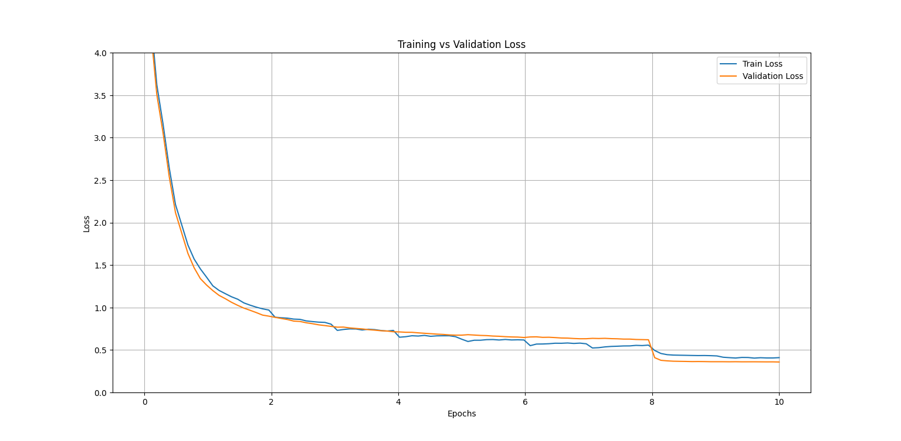

# BilingualAI: Transformer-Based English-Chinese Translation Model


## Table of Contents
- [Introduction](#introduction)
- [What Changed Since the Original](#what-changed-since-the-original)
- [How to Use](#how-to-use)
- [Dataset Details](#dataset-details)
  - [Filtering Process](#filtering-process)
- [Training Results](#-training-results)
  - [Solution: Regenerated Translation Data](#solution-regenerated-translation-data)
  - [Loss Plot](#loss-plot)
- [Notes/Observations](#notesobservations)
  - [1. Numbers](#1-numbers)
  - [2. Synonyms](#2-synonyms)
  - [3. Low-quality English](#3-low-quality-english)
- [Final Thoughts/Next Project](#final-thoughtsnext-project)


---


## Introduction
This project is a revisitation of my original work in `LanguageTranslationModel`, which I began nearly a year ago. 
My goal this time was to rebuild everything, revisit the fundamentals, and strengthen my understanding of the basics — as I believe a solid foundational knowledge is essential in this field.
This translation model have 32M parameters, trained on a dataset of 1M en-zh sentence pairs for 10 epochs. 

---

## What Changed Since the Original
Major improvements/adjustments I made:
1. **Higher-quality and larger-scale model & dataset**
2. **Better modularization and architecture**
   - My first version had some questionable design decisions now that I look back at it. This time, I focused on clean abstractions, readability, and separation of concerns.
3. **More effective training strategy**
   - Trained over more epochs while adjusting learning rates

---

## How to Use


### Prerequisites  
- Python 3.10 or later (older versions may work)
- `git-lfs` (for downloading the model weights)  
- Dependencies listed in `requirements.txt`  

### Installation  
1. **Clone the repository and navigate to the project directory:**  
   ```bash
   git clone https://github.com/IvanC987/BilingualAI  
   cd BilingualAI  
   ```

2. **Install Git LFS (if not already installed) and download the model weights:**  
   ```bash
   # For Debian/Ubuntu (Linux envs):
   sudo apt install git-lfs  
   git lfs install  # Initialize Git LFS
   git lfs pull     # Download the model (.pth file)
   ```

   *Note for Windows/macOS users:*  
   - Install Git LFS from [git-lfs.com](https://git-lfs.com), then run `git lfs pull`.  

3. **Install Python dependencies:**  
   ```bash
   pip install -r requirements.txt  
   ```

### Running the Model  
- **Interactive translation mode:**  
  Launch the script to translate English input to Chinese in real time:  
  ```bash
  python3 inference.py  
  ```


---

## Dataset Details
The dataset was compiled from the following publicly available sources on HuggingFace:

1. **[OPUS-100](https://huggingface.co/datasets/Helsinki-NLP/opus-100)** (English-Chinese subset)  
2. **[translation_zh](https://huggingface.co/datasets/shaowenchen/translation_zh)**  
3. **[coct-en-zh-tw-translations](https://huggingface.co/datasets/zetavg/coct-en-zh-tw-translations-twp-300k)**  
4. **[manythings-translations-alpaca](https://huggingface.co/datasets/xzuyn/manythings-translations-alpaca)**  

Additionally, I've also included 500k English sentences from my old project (`wmt16 de-en`).

In total, there was ~7M pairs.


### Filtering Process

Out of ~7M raw sentence pairs, I applied rigorous filtering to produce a cleaner 1M-pair dataset. <br>
The following are some of the filters used:
- English word frequency thresholding (≥ 5)
- Min/max sentence length filtering
- Removing exact duplicate pairs
- Repetitive word filtering (e.g., "yes yes yes yes")
- Special character exclusion (`*&^%$#@!...`)

Most are self-explanatory. 
The exclusion for special characters was based on a certain ratio. (E.g. if more than 10% of a en sentence is made of special chars, it will be dropped)
That removed heavily noised samples such as the following: 

---------------------
We don\\\\\\\'t have so many people from other places and we don\\\\\\\'t have Asian restaurants. The waiters in restaurants have uniforms. <br>
The changes that have occurred in the U.S. housing market in the last decade aren\\\\\\\\\\\\\\\'t much different than the changes that occurred in Japan\\\\\\\\\\\\\\\'s boom market. <br>
View <cake:nocache></cake:nocache> markup <br>
pi * ti * 0.. <br>
The /*-{ and }-*/ delimiters for the method implementation <br>
The argument of the function should be @@@ARGS@@@. <br>
I am the living example of the \\\"triangle of life\\\". <br>
sed -n 's/.*. <br>
iptables [-t table] command [match] [target] <br>
1/4 cup chopped pecans almonds or peanuts< o<="" span=""> <br>
---------------------

These were likely shell commands, code snippets, or malformed outputs. <br>
In the end, I was left with just a little north of 1M sentence pairs to work with.


## Training Results

Training on the filtered data plateaued with:
- **Train Loss**: ~0.95
- **Val Loss**: ~0.90  
- **METEOR Score**: ~0.53

This wasn't quite what I had originally expected, as the loss was actually a bit higher than my previous model and the score was a fair amount lower, indicating something was likely wrong. 
I went and started inspecting the testing dataset, and found that although filtering stage took care of a lot of low quality/bad samples, there was still quite a lot left. 
The problem was the that translation was highly inaccurate for a small chunk of the dataset, which affected the training/evaluation. 


### Solution: Regenerated Translation Data

It was at this point that I recalled how I sourced the dataset in my previous project. 
I had originally gathered all the EN sentences and used a model to generate translation, ensuring high quality. 
That was the reason why I didn't directly find and use available en-zh, as they contain highly inaccurate translations. 
I ended up doing the same thing, and created the translation using a model (This time using gemini 2.0 flash to create the zh translation) 

So I reverted to my original strategy:
- Collected high-quality English samples
- Translated them using **Gemini 2.0 Flash**
- Re-ran training on the regenerated dataset

New metrics:
- **Train Loss**: 0.41
- **Val Loss**: 0.36
- **METEOR Score**: ~0.71


A drastic improvement. 


### Loss Plot
<p align="center">

</p>

> Note: The sharp dip around epoch 8 is due to switching from a warm-up schedule (as per the original Transformer paper) to a linear decay (`linspace(1e-4, 1e-5)`) for the final epochs.


## Notes/Observations

As shown, the final METEOR score came out to be ~0.71 after evaluation of the final model
Though 0.71 is decent, I noticed several factors affecting it unfairly:


### 1. Numbers
METEOR penalizes numeric format differences:

| **Source**       | **Reference** | **Hypothesis** | **Score**       |
|------------------|--------------|----------------|-----------------|
| `Paragraph 16`   | `第16段`      | `第十六段`      | **0.17**        |

Both is correct, only difference is due to "16" vs "sixteen", which meteor docks off points for that. Quite heavily too, if the sentence is short, which is often the case.

### 2. Synonyms
The score wouldn't be able to account for synonyms because it's based on the `WordNet` model, designed for English.
Although it would recognize English synonyms, the objective here is Chinese, and so it would not be able to account for that. In this case, I highly suspect it's exact word matching, which further brings down the score for that. 
One of the example that I saw was:

| **Source**    | **Reference** | **Hypothesis** | **Score**  |
|---------------|--------------|----------------|------------|
| `Explanation:` | `解释：`      | `说明：`        | **0.25**   |

To which I assume the only reason why it wasn't a 0 was probably due to the colon lol. Without it, that would very likely be 0.0 even though both are completely valid translations.


### 3. Low-quality English
If the En sentence itself was bad, then so woudl the translation. 
Filtering did remove a lot of it, but it wasn't able to remove one's that sounded weird. 
I asked Gemini 2.0 Flash to evlaute it did remove some of those, however quite a fair amount still remained, even though I asked for it to be strict. 
For example, these en sentence were apparently good enough for the mmodel: 
- Congratulations to you it
- Finally could not help you borrow that book really sorry.
- ever i didnt know you had a baby, is it alive?
- I know you are not long for her not interested
- No matter how the bowl, as long as the protection of properly, will be in the years flow, snapped with true colors.


Among others. As one can see, some are weird and others are just plainly incoherent.

Anyways, those are the three primary problem causing the meteor score to be 'low'. 
Though 0.71 is good enough, it's not an accurate reflection of the model's capability. 


---

## Final Thoughts/Next Project

Despite imperfect evaluation, the model performs **better** than raw scores suggest.
Personally I would say this project was a success, as I had a glimpse of how much I have learned the past year by looking at my old project and gained further understanding due to this revisitation 

### What’s Next: **SimpleLLama**  
This will be a revisitation of another old project, `TransformerLM` (a theoretical "LLM" that only reached pretraining). This time, I’m scaling up ambitiously:  

1. **Model Size**: From 15M to **300–700M parameters**  
2. **Dataset**: From 4.5GB of text to **100B–300B tokens** (hundreds of GB post-tokenization)  
3. **Architecture**: Switching from vanilla Transformer to **Llama** (hence the name), with potential integrations from papers like **DeepSeek** for further optimizations  

More details to come—stay tuned! 

---

